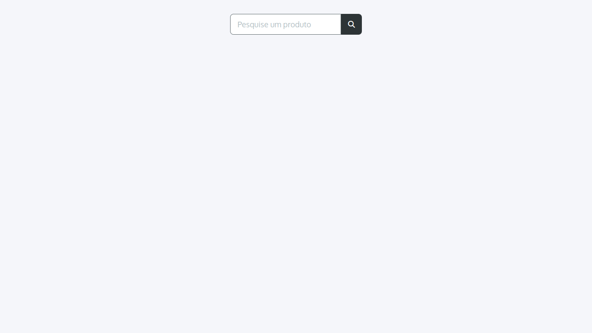
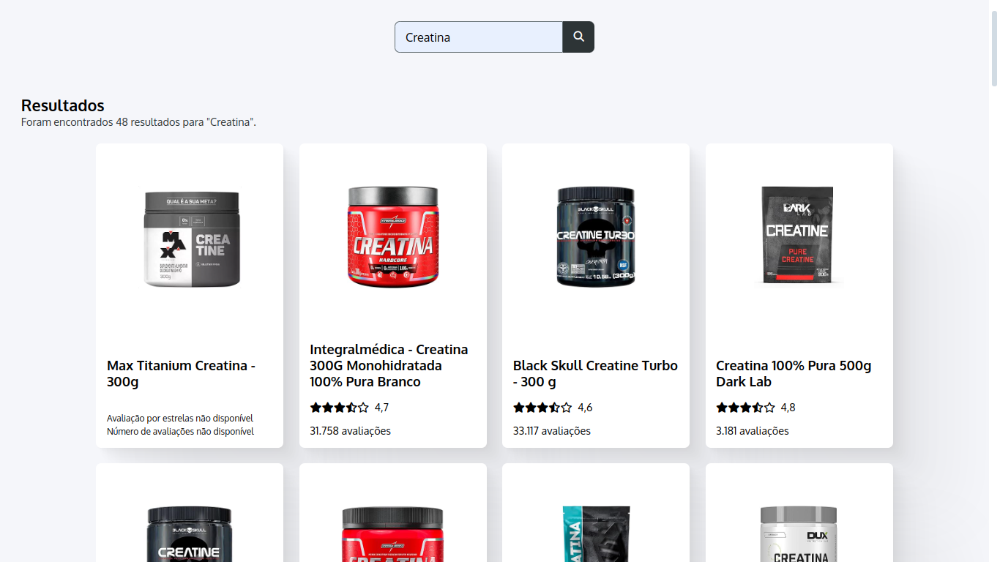
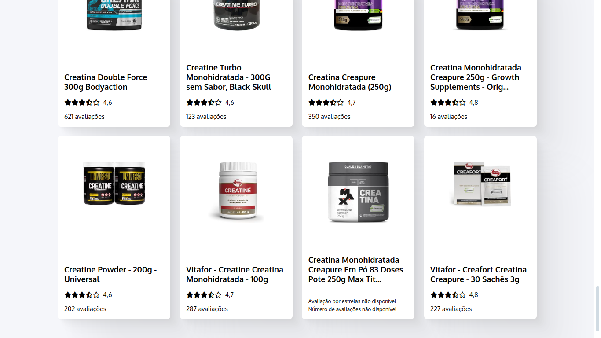
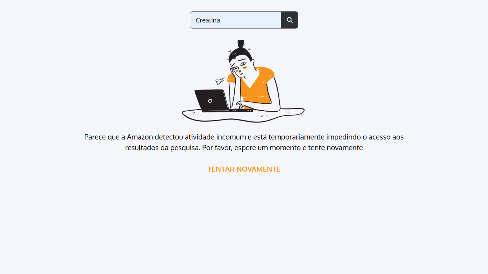
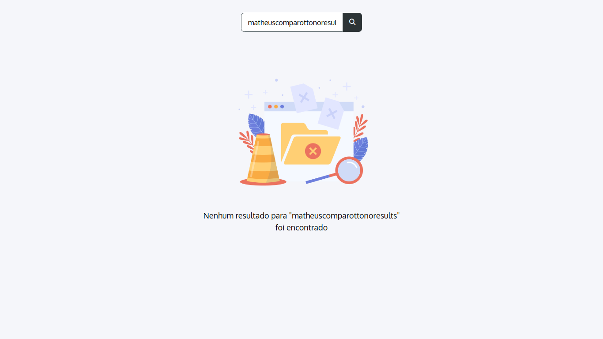

# amazon-web-scraper-showcase

## Sumário

- [amazon-web-scraper-showcase](#amazon-web-scraper-showcase)
  - [Sumário](#sumário)
  - [_To-do list_](#to-do-list)
  - [Motivação](#motivação)
    - [`GET /api/scrape`](#get-apiscrape)
      - [Motivação](#motivação-1)
      - [Exemplo de URL](#exemplo-de-url)
      - [Status 200](#status-200)
      - [Status 500](#status-500)
      - [Status 503](#status-503)
  - [Pilha de tecnologia](#pilha-de-tecnologia)
  - [Galeria](#galeria)

<details>
  <summary>
  
  ## _To-do list_
  </summary>

  - [X] Adicionar `dotenv` à API
  - [X] Criar uma variável de ambiente que funcione como uma _flag_ booleana para impedir requisições malsucedidas retornando dados falsos
  - [X] Criar um objeto de transferência de dados adequado para o método `getProducts` e colocar o total de produtos encontrados neste serviço em vez de computá-lo no diretório `routes`
  - [X] Jogar todas as mensagens de texto para o enumerador
  - [ ] ~~Criar um interruptor na página web e um parâmetro _query_ adicional para forçar a API a retornar dados falsos~~
  - [X] Criar um arquivo contendo todos os _assets_ utilizados e adicionar a fonte tipográfica Oxygen
  - [X] Procurar uma imagem que represente ficheiros vazios e substitui-la a imagem do caso de resultados não encontrados
  - [X] Adicionar uma tela para que o usuário possa refazer a requisição em caso de erro
  - [X] Adicionar um _listener_ para bloquear o botão de refazer a requisição caso o campo de texto esteja inválido ~~e estilizá-lo com transição de opacidade~~
  - [X] Adicionar um ~~_toast_~~ aviso para notificar que dados falsos estão sendo utilizados
  - [ ] ~~Criar um elemento HTML para encapsular a imagem do componente de produto e evitar que o espaçamento interno~~
  - [X] Definir uma altura máxima para as imagens dos componentes de produto que evite produtos cortados
  - [X] Adicionar reticências aos títulos longos
  - [X] Alterar os metadados do arquivo `index.html` adicionando OpenGL
  - [X] Explicar a variável de ambiente `BYPASS_SERVER_ERROR_STATUS_CODE` neste arquivo
  - [X] ~~Adicionar uma subseção "_Features_" à subseção "Motivação" para~~ explicar detalhes técnicos como o comportamento dos botões e telas adicionais em casos de erro
  - [X] Criar três repositórios[<sup>1</sup>](#nota-de-rodape-1) e hospedar a API e o site no Vercel e Firebase, respectivamente

  <sup id="nota-de-rodape-1">1</sup> Como o Vercel exige que uma API Express esteja em um único repositório de código configurado via `vercel.json` para o _deploy_, o terceiro repositório será composto apenas de um arquivo `README.md` e dois submódulos que redirecionarão o visitante para os respectivos repositórios.

  <!--
  - [ ] Adicionar bateria de testes com Postman e expressão regular na API
  - [ ] Procurar uma estrutura mais complexa com métodos como `initializeMiddlewares` para a API
  - [ ] Verificar se é possível capturar o ID do produto via _web scraping_ e fazer com que o componente na página `index.html` seja clicável e redirecione o usuário para o site da Amazon
  - [ ] Capturar a largura computada do componente de produto e, ao redimensionar a tela (que deve ter a largura mínima de 1.368px), usá-la para redefinir a largura máxima dos componentes para que a última fileira não fique com componentes maiores caso o total de produtos não seja múltiplo de quatro
  - [ ] Adicionar _skeleton_ aos cards de produtos
  -->
</details>

## Motivação

Este app é uma ferramenta de consulta a produtos da Amazon extraídos através de _web scraping_. Nos dois repositórios de código adicionados a este repositório como submódulos, não há arquivos com textos motivacionais ou instrucionais. Portanto, toda a documentação do app está disponível neste arquivo, como solicitado no teste técnico para a vaga de Estágio em Desenvolvimento Full Stack da empresa LongLifeNutri.

<details open>
  <summary>
  
  ### `GET /api/scrape`
  </summary>

  #### Motivação

  Esta rota usa os módulos [Axios](https://www.npmjs.com/package/axios) e [JSDOM](https://www.npmjs.com/package/jsdom) para fazer uma requisição HTTP à página de pesquisa de produtos; e converter os produtos buscados de elementos HTML para instâncias de produto, respectivamente.
  
  O endereço de URL da página de pesquisa de produtos é https://www.amazon.com.br/s?k=Creatina, em que `s` é a rota de pesquisa de produtos (_search_) e `k` é o parâmetro _query_ que recebe a palavra-chave do produto buscado (_keyword_). Feita a requisição, o conteúdo da página é tratado; e os componentes HTML contendo as informações dos produtos são convertidos em um vetor em que cada elemento obedece à interface[<sup>[1]</sup>](https://github.com/mdccg/amazon-web-scraper-api/blob/main/src/interfaces/IProduct.ts) abaixo. Observação: Os atributos `rating` e `numberOfReviews` seguem facultativos pois há produtos que não apresentam a média de avaliações por cinco estrelas e o respectivo número de avaliações.

  ```typescript
  interface IProduct {
    title: string;
    imageURL: string;
    rating?: number;
    numberOfReviews?: number;
  }
  ```

  Como o site da Amazon tem seu próprio detector de _bot_, spam, abuso e coisas do gênero — análogo ao reCAPTCHA da Google — por vezes esta rota retornará o status HTTP de reposta [503](https://http.cat/503) (_Service Unavailable_), indicando que a requisição foi barrada por estar sendo feita a partir de uma API Express ao invés de um navegador. Para contornar este problema em caso de demonstração da interface de usuário, foi criada a variável de ambiente `BYPASS_SERVER_ERROR_STATUS_CODE`.

  A função desta variável de ambiente booleana é retornar dados falsos — os quais foram coletados em uma das requisições HTTP bem-sucedidas para a palavra-chave "Creatina" — e impedir que esta rota retorne outro status HTTP de resposta além de [200](https://http.cat/200). Caso a variável receba `true`, [o objeto de transferência de dados](https://github.com/mdccg/amazon-web-scraper-api/blob/main/src/data-transports/ScrapeResponse.ts) desta rota informará se os dados são falsos através da propriedade booleana `isFake`:

  ```typescript
  type ScrapeResponse = {
    products: IProduct[];
    total: number;
    isFake: boolean;
  }
  ``` 

  E a propriedade `isFake` é checada no cliente front-end, o qual informa se os dados são falsos através das seguintes frases:

  > Foram encontrados 48 resultados para "Creatina".
  >
  > Foram encontrados 60 resultados **fictícios** para "Creatina".

  Vale destacar que aproximadamente apenas vinte porcento das requisições feitas durante as fases de desenvolvimento e homologação foram bem-sucedidas, ou seja, **foi necessário refazer a requisição várias vezes**. Além disso, há outras variáveis de ambiente definidas no arquivo de declaração [`environment.d.ts`](https://github.com/mdccg/amazon-web-scraper-api/blob/main/src/declarations/environment.d.ts). Essas variáveis, listadas abaixo, servem para evitar alterações _hard-code_ no código-fonte; caso o domínio, a rota ou o parâmetro _query_ da Amazon sejam modificados pela Amazon.com, Inc.

  - `AMAZON_API_BASE_URL`;
  - `AMAZON_API_PATH_NAME`;
  - `AMAZON_API_QUERY_PARAMETER`.

  #### Exemplo de URL

  Exemplo de URL: http://localhost:3001/api/scrape?keyword=Creatina

  #### Status 200

  ```json
  {
    "products": [
      {
        "title": "Max Titanium Creatina - 300g",
        "imageURL": "https://m.media-amazon.com/images/I/51fpPqn3VbL._AC_UL320_.jpg"
      },
      {
        "title": "Integralmédica - Creatina 300G Monohidratada 100% Pura Branco",
        "imageURL": "https://m.media-amazon.com/images/I/61ab639aDML._AC_UL320_.jpg",
        "rating": 4.7,
        "numberOfReviews": 31966
      },
      /* ... */
    ],
    "total": 48,
    "isFake": false
  }
  ```

  #### Status 500

  ```json
  {
    "error": "Oops! Parece que algo deu errado temporariamente. Não se preocupe, estamos trabalhando para resolver isso o mais rápido possível"
  }
  ```

  #### Status 503

  ```json
  {
    "error": "Parece que a Amazon detectou atividade incomum e está temporariamente impedindo o acesso aos resultados da pesquisa. Por favor, espere um momento e tente novamente"
  }
  ```
</details>


<!--
### Cliente front-end

Como solicitado no teste técnico, o cliente front-end...
-->

<!--
_Brainstorming_

- Layout simples e sem autenticação de usuário
- Parágrafo pequeno para falar dos assets
  * Font Awesome 5
  * Oxygen (Google Fonts)
  * Loading icon
- Responsividade com Flexbox
  * Espaçamento interno de imagens
  * Largura máxima para elementos da última fileira
-->

## Pilha de tecnologia

| Tecnologia | Função |
|-|-|
| Linguagem de programação | [TypeScript](https://www.typescriptlang.org) |
| Framework back-end | [Express](https://www.npmjs.com/package/express) |
| Cliente HTTP | [Axios](https://www.npmjs.com/package/axios) |
| _Web scraping_ | [JSDOM](https://www.npmjs.com/package/jsdom) |

Os créditos pelas mídias utilizadas estão disponíveis [aqui](https://github.com/mdccg/amazon-web-scraper-client/tree/main/assets).

## Galeria







<!--
## Como rodar

### Pré-requisitos

### Passo a passo
-->